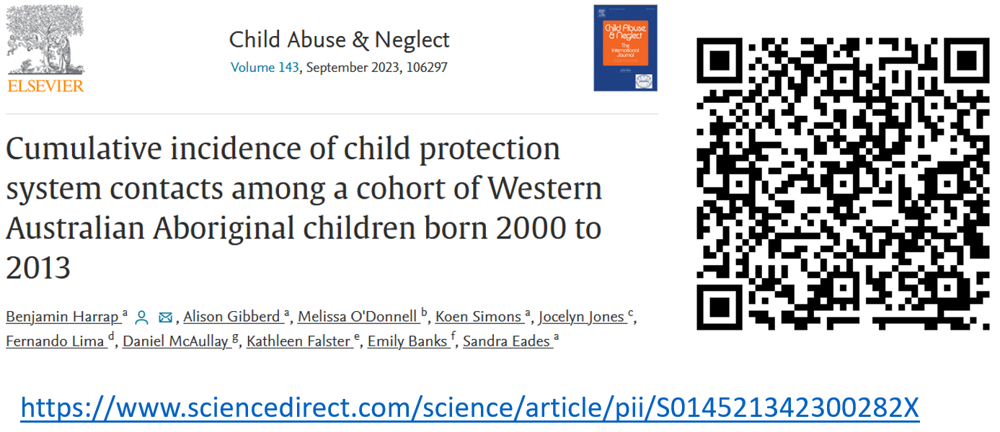
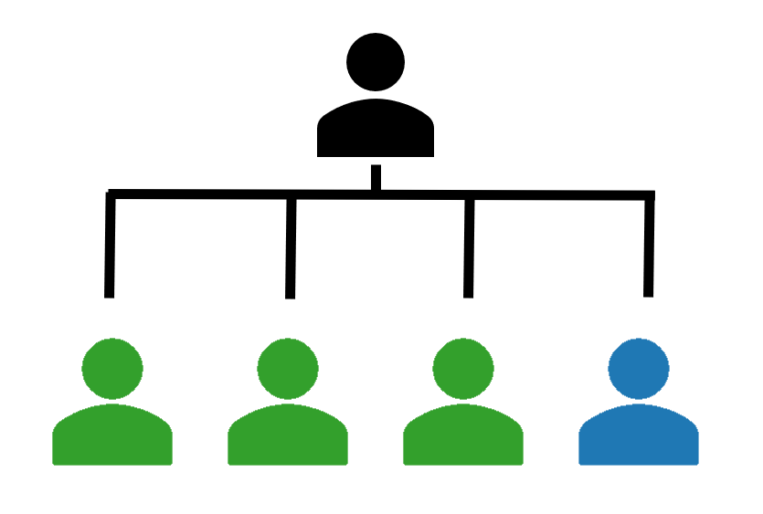
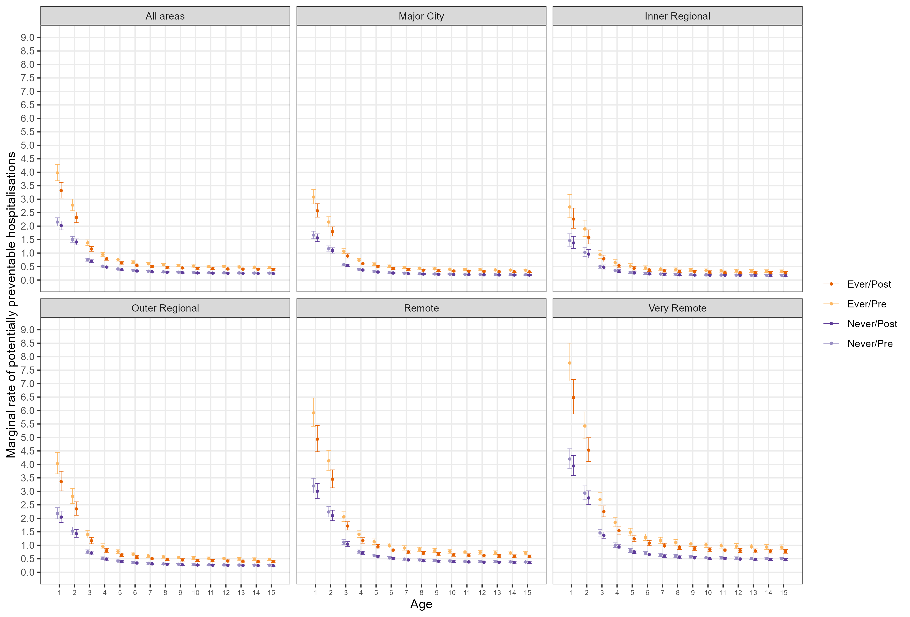
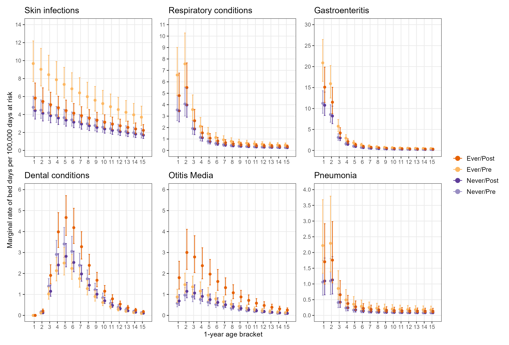

I presented my PhD completion seminar to the Melbourne School of Population and Global Health on the 10th of May, 2024. I've included the recording of the seminar here and the content from the slides is beneath. If you have any questions feel free to reach out!

<iframe width="560" height="315" src="https://www.youtube.com/embed/t-jbwoxyzak?si=jt3V4_pIwNWivsaL" title="YouTube video player" frameborder="0" allow="accelerometer; autoplay; clipboard-write; encrypted-media; gyroscope; picture-in-picture; web-share" referrerpolicy="strict-origin-when-cross-origin" allowfullscreen></iframe>

```{r setup, include=FALSE}
knitr::opts_chunk$set(echo = FALSE, warning = FALSE, message = FALSE)
# options(knitr.table.format = "latex")
library(knitr)
library(tidyverse)
library(kableExtra)
```

# Introduction

## Child removals

Aboriginal and Torres Strait Islander children are over-represented in child protection statistics in every state and territory [@aihw2022]

Risk of entering out-of-home care increased by:

- Teenage parents, substance use during pregnancy, parental intellectual disability, poor maternal mental health [@odonnell2010a;@odonnell2015;@jenkins2018;@orr2019]
- Parental experience of out-of-home care, living in low-SES areas, systemic racism [@odonnell2010a;@odonnell2015;@jenkins2018;@segal2019;@davis2019]
- Consequences of colonisation [@wilson1997;@davis2019]

## Health

Aboriginal and Torres Strait Islander children also have inequitable health outcomes:

- Higher burden of disease generally [@aihw2020c]
- Higher rates of potentially preventable hospitalisations [@aihwpph]

Attributable to housing, SES, systemic racism

- Colonisation

## Data gaps

Current research examines child protection and health independently, little on the intersection of these topics.

Of the studies that do exist, they either:

- Examine how health predicts child protection involvement [@odonnell2009;@odonnell2010a;@odonnell2010b]
- Examine specialist referrals at hospital clinics [@kaltner2011;@arora2014;@nathanson2007;@mclean2022] and Aboriginal Medical Services [@raman2011;@raman2017;@shmerling2020]

No studies quantifying specific health needs for Aboriginal children in out-of-home care or comparing to other Aboriginal children.

## I-CaRe WA study

Principal Investigator: Professor Sandra Eades

Qualitative objectives

- Explore views from Aboriginal kinship carers
- Explore views from Aboriginal primary healthcare staff

Quantitative objectives

- Examine contemporary WA child protection data
- Identify predictors of out-of-home care
- Describe the health of the children before and after entering care

## My PhD

1. Introduction and literature review
2. Methodology
3. Descriptive analysis of trends in the child protection system
4. Prevalence of mental and neurodevelopmental health conditions
5. Rates of potentially preventable hospitalisations
6. Discussion

Informed by qualitative research findings and reference group discussions

Supervisors:

- Prof Sandra Eades (University of Melbourne)
- Prof Melissa O'Donnell (University of South Australia)
- Dr Alison Gibberd (University of Melbourne)
- Dr Koen Simons (University of Gothenburg)

# Data

## Data linkage

Provided by Data Linkage Services Western Australia (DLSWA)

Probabilistic matching to link individual records across datasets[@holman2008;@eitelhuber2018]

All Aboriginal children born in Western Australia between 2000 and 2013

Data covering 2000 to 2019

## Data sources

- Birth registrations 
- Midwives Notification System
- Death registrations
- Child Protection and Family Support Data 
- Hospital Morbidity Database Collection 
- Emergency Department Database Collection
- WA Register of Developmental Anomalies - Birth defects
- WA Register of Developmental Anomalies - Cerebral Palsy
- Intellectual Disability Exploring Answers
- Mental Health Information System

# Chapter 3 - Cumulative incidence of child protection system contacts among a cohort of Western Australian Aboriginal children born 2000 to 2013

## Published paper [@harrap2023]

```{r, echo=FALSE, out.width="80%"}

```

## Aims

1. Examine contacts with CPS by stage and birth cohort
2. Examine how contacts are clustered within sibling groups

## Methods

Data

- Child protection data from 2000 to 2015

Analysis

- Cumulative incidence
  - By two-year birth cohort
  - By sibling contact status
- Tabulation of timing of placements relative to first within sibling group

## Cumulative incidence of first contacts with CPS, 2000 to 2015

```{r, out.width="70%"}
include_graphics("../../static/post/completion-seminar/cps_all.pdf")
```

## Cumulative incidence of first contacts with CPS, 2000 to 2015, by year of birth

```{r, out.width="70%"}
include_graphics("../../static/post/completion-seminar/cps_year.pdf")
```

## Siblings

```{r, out.width="50%"}

```

## Timing of contacts within maternal sibling groups, 2000-2015

```{r}
read_csv("../../static/post/completion-seminar/cps_sib.csv") |>
  kable(
    booktabs = T,
    align = "c",
    col.names = c("Stage",
                  "N",
                  "%",
                  "N",
                  "%",
                  "N",
                  "%"),
    linesep = ""
  ) |>
  kable_styling(latex_options = "scale_down") |>
  add_header_above(c(
    "",
    "Same as first contact" = 2,
    "After first contact" = 2,
    "No contact" = 2
  ))
```

## Siblings

```{r, out.width="50%"}

```

## Cumulative incidence of contacts by birth relative to first contact

```{r, out.width="80%"}
include_graphics("../../static/post/completion-seminar/cps_sib.pdf")
```

# Chapter 4 - Mental and neurodevelopmental health needs of Aboriginal children with experience of out-of-home care: a Western Australian data-linkage study

## Aims

1. Estimate prevalence of mental and neurodevelopmental health conditions for ever/never placed Aboriginal children
2. Examine cumulative incidence of conditions for ever/never placed children
3. Compare conditions for ever placed Aboriginal children depending on when first placement occurred (pre/post 1-year old)

## Methods

Matched never-placed children to ever-placed children, 2:1 on:

- Year of birth
- Remoteness area at birth [@remotenessarea]
- Index of relative socioeconomic advantage/disadvantage at birth [@seifa]

Estimated prevalence of mental and neurodevelopmental conditions using:

- Hospital data
- Mental Health Information System
- Registries

## Prevalence estimates for never vs. ever placed children (N=11,159)

```{r}
read_csv("../../static/post/completion-seminar/hp_a1.csv") |>
  filter(condition != "Conduct") |>
  select(1, 2, 3) |> 
  mutate(
    across(
      2:3,
      ~ str_extract(., "(?<=\\[).+[^\\]]+")
    )
  ) |>
  kable(
    booktabs = T,
    align = "c",
    linesep = "",
    col.names = c("Condition",
                  "Never placed n=7,439",
                  "Ever placed n=3,720")
  ) 
```

## Results

```{r, out.width="60%"}
include_graphics("../../static/post/completion-seminar/hp_cond.pdf")
```

## Prevalence estimates for placement pre vs. post 1-yr old (N=3,432)

```{r}
read_csv("../../static/post/completion-seminar/hp_a1.csv") |>
  filter(condition != "Conduct") |>
  select(1, 4, 5) |>
  mutate(
    across(
      2:3,
      ~ str_extract(., "(?<=\\[).+[^\\]]+")
    )
  ) |>
  kable(
    booktabs = T,
    align = "c",
    linesep = "",
    col.names = c("Condition",
                  "Pre 1-year n=1,098",
                  "Post 1-year n=2,333")
  )
```

# Chapter 5 - Using data linkage to compare rates and types of potentially preventable hospitalisations for Aboriginal children born in Western Australia with experience of out-of-home care

## Aims

1. Estimate rates of potentially-preventable hospitalisations (PPHs) for ever and never-placed Aboriginal children
2. Compare types of conditions diagnosed during PPHs for ever and never-placed children
3. Estimate rates of PPHs for ever-placed children before and after their first placement

## Methods

Matching never-placed to ever-placed children 2:1 on month-year of birth, remoteness, and socio-economic status.

Estimate incidence rate of days spent in hospital where primary diagnosis was PPH condition using child-appropriate definition [@anderson2012]

- Rates expressed as days in hospital per 1,000 days at risk
- Rate ratios used to compare groups

Estimate effect of placement in care on rate of admissions using mixed-effects model

## Incidence rate for ever and never-placed children

```{r}
options(knitr.kable.NA = '')
pph_a1 <- read_csv("../../static/post/completion-seminar/pph_a1.csv")

pph_a1 |> 
  filter(
    age_group == "0-4" |
    age_group == "5-9" |
    age_group == "10-14" |
    age_group == "All"
  ) |> 
  mutate(irr = ifelse(exposure=="Never placed",NA,irr)) |>
  select(-hospital_days, -days_at_risk) |> 
  kable(
    align = "c",
    booktabs = T,
    linesep = "",
    col.names = 
      c(
        "Age group",
        "Exposure",
        # "PPH days",
        # "Days at risk",
        "Incidence rate",
        "IRR"
      )
  ) |>
  kable_styling(latex_options = c("scale_down","striped")) |> 
  add_footnote(label = "Rate per 1,000 days at risk")
```

## Most common PPH conditions

```{r}
options(knitr.kable.NA = '')
read_csv("../../static/post/completion-seminar/pph_cond.csv") |> 
  kable(
    align = "c",
    booktabs = T,
    linesep = "",
    col.names =
      c(
        "Diagnosis",
        "Never",
        "Ever",
        "Never",
        "Ever",
        "Never",
        "Ever"
      )
  ) |>
  add_header_above(
    c(
      " " = 1,
      "Ages 0-4" = 2,
      "Ages 5-9" = 2,
      "Ages 10-14" = 2
    )
  ) |> 
  kable_styling(latex_options = c("scale_down","striped"))
```

## Incidence rate for pre/post first placement

```{r}
options(knitr.kable.NA = '')
pph_a2 <- read_csv("../../static/post/completion-seminar/pph_a2.csv")

pph_a2 |> 
  filter(
    age_group == "0-4" |
    age_group == "5-9" |
    age_group == "10-14" |
    age_group == "All ages"
  ) |> 
  mutate(irr = ifelse(exposure=="Pre-placement",NA,irr)) |> 
  select(-hospital_days, -days_at_risk) |> 
  kable(
    align = "c",
    booktabs = T,
    linesep = "",
    col.names = c(
      "Age group",
      "Exposure",
      # "PPH days",
      # "Days at risk",
      "Incidence rate",
      "IRR"
    )
  ) |>
  kable_styling(latex_options = c("scale_down","striped")) |> 
  add_footnote(label = "Rate per 1,000 days at risk")
```

## DAG

```{r, echo = FALSE, out.width="70%"}
library(dagitty)
dag <- dagitty('dag {
bb="-4.804,-4.019,4.485,3.592"
"PPH Rate" [outcome,pos="1.002,0.416"]
"Parent SES" [adjusted,pos="-0.278,-2.546"]
"Parent drug use" [pos="-1.203,-2.050"]
"Parent removed as child" [adjusted,pos="1.389,-2.110"]
"Parental MH" [pos="-1.504,-1.271"]
"Parental int. dis." [pos="-1.563,-0.620"]
"Sibling placed" [pos="-0.770,1.426"]
"Teenage parent" [pos="-1.334,0.108"]
Age [adjusted,pos="-0.127,1.460"]
Culture [pos="0.897,-2.880"]
FDV [pos="1.730,-1.014"]
Housing [pos="0.831,-1.211"]
Placement [exposure,pos="-0.383,0.347"]
Remoteness [adjusted,pos="0.720,1.503"]
"Parent SES" -> "PPH Rate"
"Parent SES" -> "Parent drug use"
"Parent SES" -> "Parental MH"
"Parent SES" -> "Teenage parent"
"Parent SES" -> FDV
"Parent SES" -> Housing
"Parent drug use" -> Placement
"Parent drug use" <-> "Parental MH"
"Parent removed as child" -> "Parent SES"
"Parent removed as child" -> "Parent drug use"
"Parent removed as child" -> "Parental MH"
"Parent removed as child" -> FDV
"Parental MH" -> Placement
"Parental int. dis." -> Placement
"Sibling placed" -> Placement
"Teenage parent" -> Placement
Age -> "PPH Rate"
Age -> Placement
Culture -> "Parent removed as child"
Culture -> Placement
FDV -> "PPH Rate"
FDV -> Placement
Housing -> "PPH Rate"
Housing -> Placement
Placement -> "PPH Rate"
Remoteness -> "PPH Rate"
Remoteness -> Placement
}
')
plot(dag)
```

## Model fit

Negative binomial regression with random intercepts

`Count ~ Exposure + Pre_Post + Exposure*Pre_Post + log(Age) + I(Age^0.5) + Remoteness + IRSAD + (1 | id) + offset(log(Followup))`

Estimated average causal effect: IRR 0.89 (95% CI 0.82 - 0.97)

## Marginal rates per 1,000 days at risk across follow-up

```{r, out.width = "80%"}

```

## Marginal rates per 100,000 days at risk by condition

```{r, out.width = "80%"}

```

# Bringing it together

## Summary

1. Rates of contact with CPS have been occurring at younger ages for children born more recently
2. Contacts are clustered within sibling groups and risk carries over to siblings born later
3. Prevalence of mental and neurodevelopmental health ~3x higher for children in OOHC compared to children never removed
4. Prevalence of neurodevelopmental health conditions ~2x higher for children removed before the age of one than children first removed after the age of one
5. Rates of PPHs are higher for ever-placed children across all ages
6. Rates remain higher compared to never-placed children, even after CPS intervention
7. Placement in care has largest impact on PPHs in first few years of life

## Child protection implications

- Parents with children removed need more support
  - We know they are at increased risk of future children being removed
  - Reunification and prevention of future removals
- Support needs to be culturally safe
- Input from Aboriginal people and Elders important in decision making process
  - Staff within child protection system
  - Aboriginal family-led decision making
  - Assigning child protection responsibilities to Aboriginal agencies

## Health implications

Children with experience of out-of-home care often have multiple, complex health needs

- Public health system capacity is an issue (for everyone)
  - Availability of affordable general practice
  - Lengthy wait times for specialist care
  - Increase in culturally competent medical professionals
- Reducing risk of PPHs
  - Improvements in housing
  - Access and availability of healthcare
    - Transport
    - Wait times
    - Cost

## What this contributes

- Addresses research gap
  - "We already knew this"
  - Quantifies some intersections of child protection and health
- Prioritising Aboriginal voices in the research process
- Laying groundwork for future research
  - Disaggregation by region
  - Building on DAG, include broader datasets
  - Estimating effects of policy changes
  - Measuring informal care

## Research translation activities

- Translational workshops with community, government stakeholders, peak bodies
- Presentations to staff at NSW and WA child protection offices
- Presentation at International Population Data Linkage Conference 2022
- Infographics and lay summaries
- Open-access publications

# Acknowledgements

## Data custodians

I wish to thank the staff at DLSWA and the custodians of the Birth registrations,  Midwives Notification System, Death registrations, Child Protection and Family Support Data, Hospital Morbidity Database Collection, Emergency Department Database Collection, WA Register of Developmental Anomalies - Birth defects, WA Register of Developmental Anomalies - Cerebral Palsy, Intellectual Disability Exploring Answers, Mental Health Information System. 

The information presented does not reflect the views of the Data Linkage Branch or any of the data custodians.

## Thanks

- Supervisory team
- PhD cohort
- Family and friends
- Community reference group

# References

<div id="refs"></div>